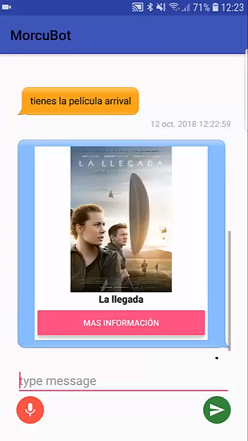

# morcu-bot

Bot desarrollado para el proyecto de fin de grado de David Morcuende Cantador: _Diseño y construcción de un Bot de entretenimiento_

__Puede encontrar una presentacion sobre el proyecto en el fichero [presentacion TFG.pptx](https://github.com/Morcu/morcu-bot/blob/master/presentacion%20TFG.pptx) y una demostración en el siguiente video:__

[](https://youtu.be/bRRZV1RpTWg "DEMO")

## Estructura del repositorio
- [bottfg](bottfg): core del bot que gestiona el dialogo
- [cognitive](cognitive): modulo desarrollado en typescript que se encarga de encontrar titulos y nombres en toda la base de datos 
- [data_bulk](data_bulk): modulos de procesado y volcado de datos
- [gram](gram): modulos de gramaticas (ANTLR)
- [mem](mem): memoria del trabajo
- [ner_client](ner_client): modulo etiquetador de entidades nombradas
- [rasa](rasa): procesamiento de lenguaje natural. Clasificador de entidades e intenciones
- [recommend](recommend): recomendador de peliculas y series
- [script_film_info](script_film_info): extractor de la informacion relacionada con peliculas y series
- [tfgdlbc](tfgdlbc): aplicacion android que actua de interfaz con el bot


## Ejecución 

Para ejecutar el sistema completo se puede hacer uso del docker-compose

```
docker-compose up -d
```
